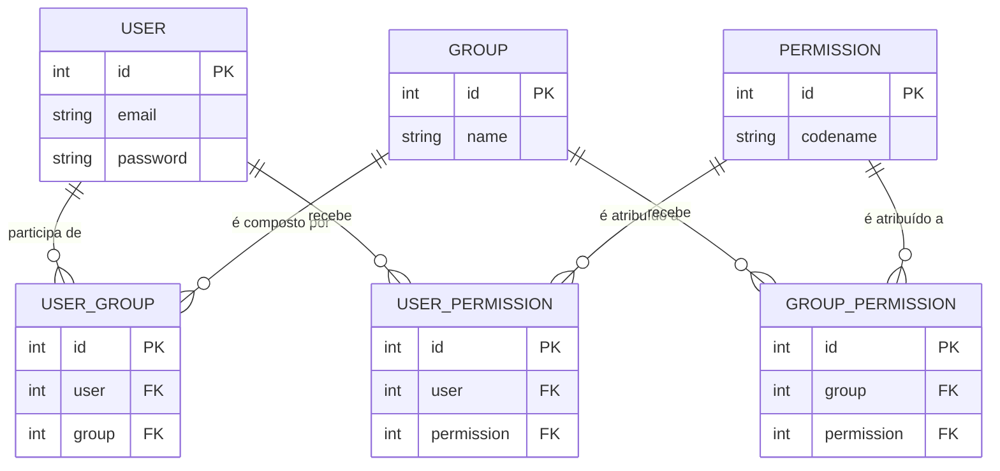

Tabelas padrões que o Django cria ao iniciar um projeto Django:

```mermaid
erDiagram
    USER {
        int    id PK
        string email
        string password
    }
    GROUP {
        int    id PK
        string name
    }
    PERMISSION {
        int    id PK
        string codename
    }
    USER_GROUP {
        int    id PK
        int    user FK
        int    group FK
    }
    USER_PERMISSION {
        int    id PK
        int    user FK
        int    permission FK
    }
    GROUP_PERMISSION {
        int    id PK
        int    group FK
        int    permission FK
    }

    USER           ||--o{ USER_GROUP        : "participa de"
    GROUP          ||--o{ USER_GROUP        : "é composto por"
    USER           ||--o{ USER_PERMISSION   : "recebe"
    PERMISSION     ||--o{ USER_PERMISSION   : "é atribuído a"
    GROUP          ||--o{ GROUP_PERMISSION  : "recebe"
    PERMISSION     ||--o{ GROUP_PERMISSION  : "é atribuído a"
```

