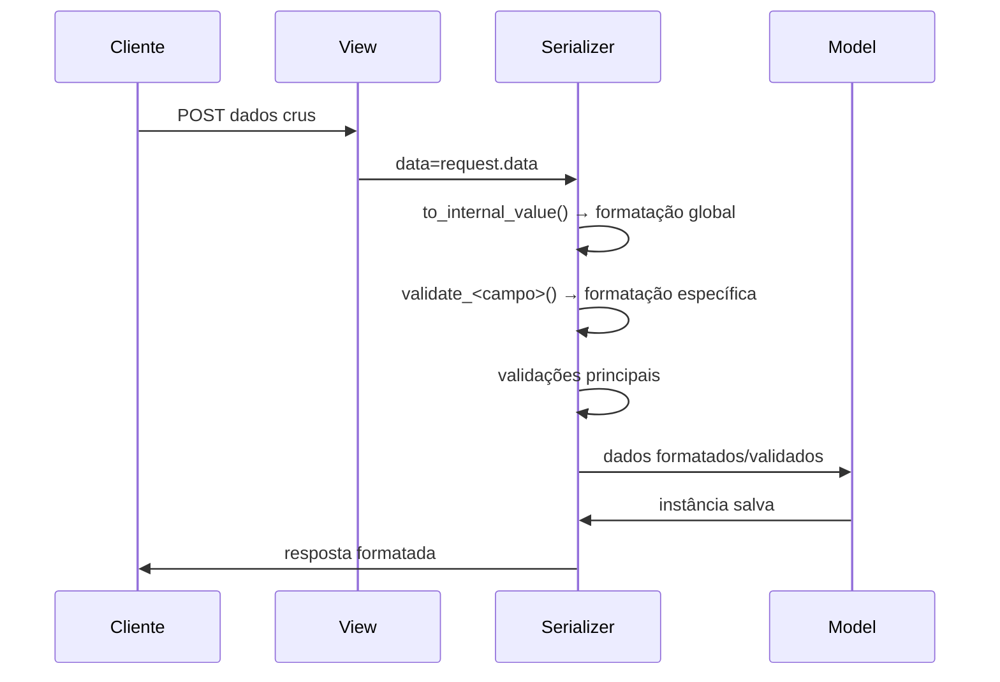

Vamos organizar esse processo de formatação de dados de forma estruturada, seguindo as melhores práticas do DRF:

## Camada Ideal: **Serializers**
A formatação/transformação de dados deve ser feita **no nível do serializer**, antes da validação principal. Isso mantém a view limpa e segue o princípio de responsabilidade única.

### Estrutura Recomendada:
```python
# serializers.py
from rest_framework import serializers
from datetime import datetime

class MeuSerializer(serializers.ModelSerializer):
    campo_data = serializers.DateField(format='%d/%m/%Y', input_formats=['%d-%m-%Y', '%Y/%m/%d'])
    
    class Meta:
        model = MeuModelo
        fields = '__all__'

    # --------------------------------------
    # 1. Formatação por campo (melhor para casos específicos)
    # --------------------------------------
    def validate_nome(self, value):
        """Capitaliza nome próprio e remove espaços extras"""
        return value.strip().title()

    # --------------------------------------
    # 2. Normalização global (para regras aplicáveis a múltiplos campos)
    # --------------------------------------
    def to_internal_value(self, data):
        # Executa antes de qualquer validação
        for key in ['cidade', 'rua']:
            if key in data:
                data[key] = data[key].strip().title()
        
        return super().to_internal_value(data)

    # --------------------------------------
    # 3. Campos customizados (para lógica reutilizável)
    # --------------------------------------
    def validate_telefone(self, value):
        """Remove caracteres não numéricos"""
        return ''.join(filter(str.isdigit, value))
```

## Casos Comuns & Soluções Detalhadas:

### 1. Capitalização Automática
```python
def validate_nome_completo(self, value):
    # "  joÃO   silVA  " → "João Silva"
    parts = [part.strip().capitalize() for part in value.split()]
    return ' '.join(parts)
```

### 2. Formatação de Datas
```python
# Aceita múltiplos formatos de entrada e padroniza
class DataCustomizadaField(serializers.DateField):
    def to_internal_value(self, value):
        try:
            # Tenta parsear em vários formatos
            return datetime.strptime(value, '%d-%m-%Y').date()
        except ValueError:
            try:
                return datetime.strptime(value, '%Y/%m/%d').date()
            except ValueError:
                self.fail('invalid', format='DD-MM-AAAA ou AAAA/MM/DD')
```

### 3. Normalização de Strings
```python
# Remove espaços, normaliza caracteres especiais
def to_internal_value(self, data):
    data = super().to_internal_value(data)
    
    if 'endereco' in data:
        data['endereco'] = (
            data['endereco']
            .translate(str.maketrans('áàãâ', 'aaaa'))  # Normalização
            .strip()
        )
    
    return data
```

## Fluxo de Processamento Ideal


## Boas Práticas Comprovadas

1. **Separação por Responsabilidade**
   ```python
   # ✔️ Correto (no serializer)
   def validate_cep(self, value):
       return value.replace('-', '').strip()

   # ❌ Evitar (na view)
   def post(self, request):
       data = request.data.copy()
       data['cep'] = data['cep'].replace('-', '')
       serializer = MeuSerializer(data=data)
   ```

2. **Camadas de Transformação**
   - **1ª Camada:** `to_internal_value()` → normalizações globais
   - **2ª Camada:** `validate_<campo>()` → regras específicas
   - **3ª Camada:** Validação do modelo/serializer → checagem de constraints

3. **Testabilidade**
   ```python
   def test_serializer_normalizacao_nome(self):
       data = {'nome': '  maria  ', 'email': 'test@example.com'}
       serializer = MeuSerializer(data=data)
       assert serializer.is_valid()
       assert serializer.validated_data['nome'] == 'Maria'
   ```

4. **Performance**
   - Evite múltiplas iterações nos dados
   - Use expressões regulares compiladas para padrões complexos
   ```python
   import re
   CEP_REGEX = re.compile(r'\d{5}-?\d{3}')

   def validate_cep(self, value):
       match = CEP_REGEX.fullmatch(value)
       if not match:
           raise serializers.ValidationError("CEP inválido")
       return value.replace('-', '')
   ```

## Caso Completo: Serializer com Formatação
```python
class UsuarioSerializer(serializers.ModelSerializer):
    data_nascimento = DataCustomizadaField()
    
    class Meta:
        model = Usuario
        fields = ['nome', 'cpf', 'data_nascimento', 'logradouro']
    
    def to_internal_value(self, data):
        # Normalização global
        data = data.copy()
        for key in ['nome', 'logradouro']:
            if key in data:
                data[key] = data[key].strip().title()
        
        return super().to_internal_value(data)
    
    def validate_cpf(self, value):
        cleaned = ''.join(filter(str.isdigit, value))
        if len(cleaned) != 11:
            raise serializers.ValidationError("CPF inválido")
        return cleaned
    
    def validate(self, attrs):
        # Validação cruzada pós-formatação
        if attrs.get('data_nascimento') > date.today():
            raise serializers.ValidationError({"data_nascimento": "Data futura inválida"})
        return attrs
```

Essa estrutura garante que os dados estejam:
1. Formatados corretamente antes das validações
2. Padronizados para o formato do banco de dados
3. Validados de forma consistente
4. Prontos para uso na camada de negócio

Sempre prefira esta abordagem a fazer transformações na view ou no model.save()

---
# Tutorial: Formatação de Dados em Serializers DRF
## 🛠️ **Passo 1: Defina os Models**
### `users/models.py`
```python
from django.db import models
from django.core.validators import MinLengthValidator

class UserProfile(models.Model):
    full_name = models.CharField(max_length=100)
    email = models.EmailField(unique=True)
    birth_date = models.DateField()
    phone = models.CharField(
        max_length=15,
        validators=[MinLengthValidator(10)]
    )
    created_at = models.DateTimeField(auto_now_add=True)

    def __str__(self):
        return self.full_name
```

---

## 🧩 **Passo 2: Serializer Base**
### `users/serializers.py` (Versão inicial)
```python
from rest_framework import serializers
from .models import UserProfile

class UserProfileSerializer(serializers.ModelSerializer):
    class Meta:
        model = UserProfile
        fields = ['full_name', 'email', 'birth_date', 'phone']
```

---

## 🔧 **Passo 3: Implementando Formatação de Dados**

### 3.1 Formatação de Nomes (Capitalização)
```python
def validate_full_name(self, value):
    """Formata 'maria silva' → 'Maria Silva'"""
    return ' '.join([part.strip().capitalize() for part in value.split()])
```

### 3.2 Normalização de Telefone
```python
def validate_phone(self, value):
    """Transforma '(11) 98765-4321' → '11987654321'"""
    return ''.join(filter(str.isdigit, value))
```

### 3.3 Campo de Data Customizado
```python
class CustomDateField(serializers.DateField):
    def to_internal_value(self, value):
        # Aceita múltiplos formatos: 'dd/mm/aaaa', 'aaaa-mm-dd', etc.
        try:
            return datetime.strptime(value, '%d/%m/%Y').date()
        except ValueError:
            try:
                return datetime.strptime(value, '%Y-%m-%d').date()
            except ValueError:
                self.fail('invalid', format='DD/MM/AAAA ou AAAA-MM-DD')
```

---

## 🚀 **Passo 4: Serializer Completo**
### `users/serializers.py` (Versão final)
```python
from rest_framework import serializers
from datetime import datetime
from .models import UserProfile

class CustomDateField(serializers.DateField):
    def to_internal_value(self, value):
        try:
            return datetime.strptime(value, '%d/%m/%Y').date()
        except ValueError:
            try:
                return datetime.strptime(value, '%Y-%m-%d').date()
            except ValueError:
                self.fail('invalid', format='DD/MM/AAAA ou AAAA-MM-DD')

class UserProfileSerializer(serializers.ModelSerializer):
    birth_date = CustomDateField()
    
    class Meta:
        model = UserProfile
        fields = '__all__'
        extra_kwargs = {
            'email': {'validators': []}  # Remove validação única temporária
        }

    def validate_full_name(self, value):
        return ' '.join([part.strip().capitalize() for part in value.split()])

    def validate_phone(self, value):
        return ''.join(filter(str.isdigit, value))

    def validate(self, data):
        # Validação cruzada: nome não pode conter números
        if any(char.isdigit() for char in data['full_name']):
            raise serializers.ValidationError(
                {"full_name": "Nomes não podem conter números"}
            )
        return data
```

---

## ✅ **Passo 5: Testando com Views**
### `users/views.py`
```python
from rest_framework import generics
from .models import UserProfile
from .serializers import UserProfileSerializer

class UserProfileCreateView(generics.CreateAPIView):
    queryset = UserProfile.objects.all()
    serializer_class = UserProfileSerializer
```

### `users/urls.py`
```python
from django.urls import path
from .views import UserProfileCreateView

urlpatterns = [
    path('users/', UserProfileCreateView.as_view(), name='user-create'),
]
```

---

## 🔬 **Passo 7: Testando com Requests**
### Exemplo de POST
```bash
curl -X POST http://localhost:8000/api/users/ \
-H "Content-Type: application/json" \
-d '{
    "full_name": "  joÃO da silva  ",
    "email": "joao@example.com",
    "birth_date": "01/01/1990",
    "phone": "(11) 98765-4321"
}'
```

### Saída Esperada no Banco
```python
{
    "full_name": "João Da Silva",
    "email": "joao@example.com",
    "birth_date": "1990-01-01",  # Formato ISO
    "phone": "11987654321"
}
```

---

## 🏆 **Boas Práticas Profissionais**

### 1. Separação de Responsabilidades
- **Models:** Apenas estrutura de dados
- **Serializers:** Validação + Formatação
- **Views:** Orquestração do fluxo

### 2. Validação em Camadas
1. **Formatação:** `to_internal_value()`
2. **Validação por Campo:** `validate_<field>()`
3. **Validação Cruzada:** `validate()`

### 3. Testabilidade
```python
# tests/test_serializers.py
from django.test import TestCase
from users.serializers import UserProfileSerializer

class UserSerializerTest(TestCase):
    def test_phone_formatting(self):
        data = {
            'full_name': 'Maria Silva',
            'email': 'maria@test.com',
            'birth_date': '01/01/2000',
            'phone': '(11) 9999-8888'
        }
        serializer = UserProfileSerializer(data=data)
        self.assertTrue(serializer.is_valid())
        self.assertEqual(serializer.validated_data['phone'], '1199998888')
```

### 4. Segurança
- **Sanitização:** Sempre use `strip()` em strings
- **Injeção SQL:** Use ORM do Django (`get_or_create` ao invés de SQL bruto)
- **XSS:** DRF escapa automaticamente HTML em respostas JSON

### 5. Performance
- Evite múltiplas iterações nos mesmos dados
- Use `@cached_property` para dados derivados caros
- Para normalização intensiva, considere tasks assíncronas

---

## 🚨 **Problemas Comuns & Soluções**

### Problema 1: Data com formato inválido
**Sintoma:**
```json
{"birth_date": ["Formato inválido. Use DD/MM/AAAA ou AAAA-MM-DD."]}
```
**Solução:**
- Verifique os formatos suportados no `CustomDateField`
- Use máscaras no frontend para guiar o usuário

### Problema 2: Números no nome
**Sintoma:**
```json
{"full_name": ["Nomes não podem conter números"]}
```
**Solução:**
- Adicione validação no frontend antes do envio
- Use regex no serializer:
```python
import re
if re.search(r'\d', value):
    raise ValidationError("Nomes não podem conter dígitos")
```

### Problema 3: Telefone incompleto
**Sintoma:**
```json
{"phone": ["Certifique-se que este campo tenha pelo menos 10 caracteres."]}
```
**Solução:**
- Após a formatação, adicione validação de tamanho:
```python
def validate_phone(self, value):
    value = ''.join(filter(str.isdigit, value))
    if len(value) not in (10, 11):
        raise ValidationError("Telefone inválido")
    return value
```

---

## 📈 Fluxo de Dados Completo
```plaintext
1. Requisição POST → Dados Brutos
2. Parser → Converte para dict Python
3. to_internal_value() → Formatação Global
4. validate_<field>() → Formatação Específica
5. validate() → Validação Cruzada
6. serializer.save() → Cria Instância
7. Resposta → Dados Formatados (ex: datas em ISO)
```

---

## 📚 Recursos Adicionais
1. **Documentação Oficial:**
   - [Serializers - DRF](https://www.django-rest-framework.org/api-guide/serializers/)
   - [Custom Fields](https://www.django-rest-framework.org/api-guide/fields/#custom-fields)

2. Ferramentas Úteis:
   - `django-phonenumber-field` para validação avançada de telefones
   - `python-dateutil` para parsing flexível de datas
   - `django-filter` para filtros complexos

3. Livros Recomendados:
   - "Django for APIs" by William S. Vincent
   - "Two Scoops of Django 3.x" by Daniel & Audrey Feldroy

---

Com esse guia completo, você consegue:
- Implementar formatação complexa de dados
- Criar validações customizadas
- Manter um código organizado e testável
- Evitar armadilhas comuns em APIs Django

Sempre que precisar implementar uma nova regra de formatação:
1. Identifique a camada correta (serializer)
2. Escreva testes unitários
3. Documente os formatos aceitos
4. Atualize a documentação da API